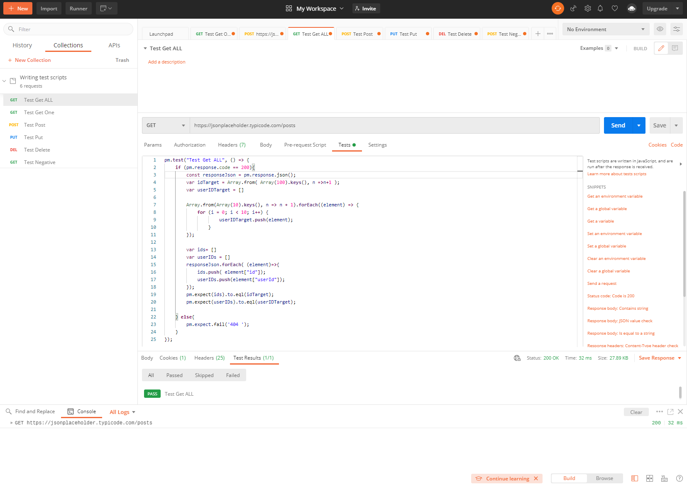

I design test for compare id and userID for the original and the GET return. 

## GET https://jsonplaceholder.typicode.com/posts

For GET all the values, comparing for all the IDs. My script able to generate different range of id with only One to Two numbers change.

## GET https://jsonplaceholder.typicode.com/posts/1

## POST https://jsonplaceholder.typicode.com/posts

## PUT https://jsonplaceholder.typicode.com/posts/1

## DELETE https://jsonplaceholder.typicode.com/posts/1

## negative test: POST https://jsonplaceholder.typicode.com/posts/1

## How to run my test script:
1. Using Postman UI application, load "test_script_collection.json" and run
2. Using Newman: install newman on your environment like "npm install -g newman" then run by input "newman run test_script_collection.json"

## How would you run your tests in a DevOps pipeline:
Answer from my knowledge understanding, some DevOps tools, like Azure Devops an JIRA. You can arrange your test script, resources(like Database), and so on to automatively run your test scripts on pre-set time period or frequency. 
